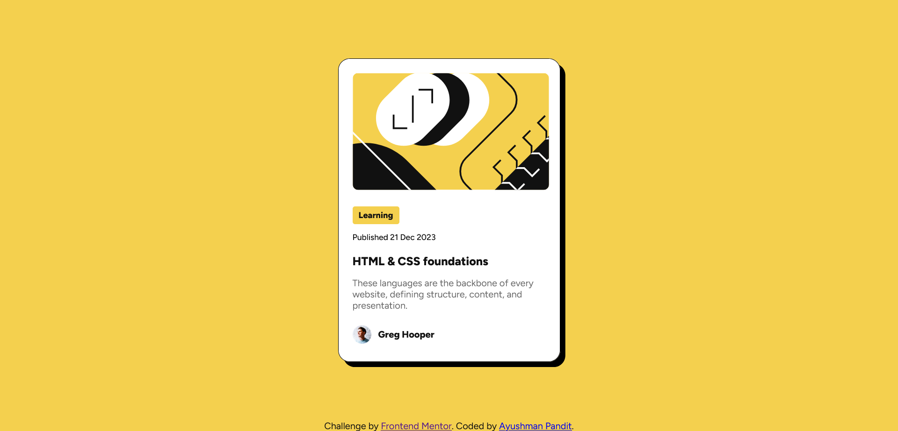

# Frontend Mentor - Blog preview card solution

This is a solution to the [Blog preview card challenge on Frontend Mentor](https://www.frontendmentor.io/challenges/blog-preview-card-ckPaj01IcS). Frontend Mentor challenges help you improve your coding skills by building realistic projects.

## Table of contents

-   [Overview](#overview)
    -   [The challenge](#the-challenge)
    -   [Screenshot](#screenshot)
    -   [Links](#links)
-   [My process](#my-process)
    -   [Built with](#built-with)
    -   [What I learned](#what-i-learned)
    -   [Continued development](#continued-development)
    -   [Useful resources](#useful-resources)
-   [Author](#author)
-   [Acknowledgments](#acknowledgments)

## Overview

### The challenge

Users should be able to:

-   See hover and focus states for all interactive elements on the page

### Screenshot

### Links

-   Solution URL: [Add solution URL here](https://your-solution-url.com)
-   Live Site URL: [Add live site URL here](https://your-live-site-url.com)

## My process

-   Reviewed the designs and the style guide to plan my process
-   Wrote the html file for the page using semantic tags and gave them appropriate classes as per requirement
-   Styled the page using css in a stylesheet one element at a time until satisfied

### Built with

-   Semantic HTML5 markup
-   CSS custom properties
-   Flexbox

### What I learned

This was my first front end project and I had a lot of fun doing it. I learned how to center divs, style stuff accordingly to make them look clean and professional. I also learned how to use figma as a developer.

### Continued development

I wish to tackle further projects so that I can get more comfortable with stuff like Flexbox and Grid, then later learn JavaScript to make better websites.

## Author

-   Frontend Mentor - [@AyushmanPandit](https://www.frontendmentor.io/profile/AyushmanPandit)
